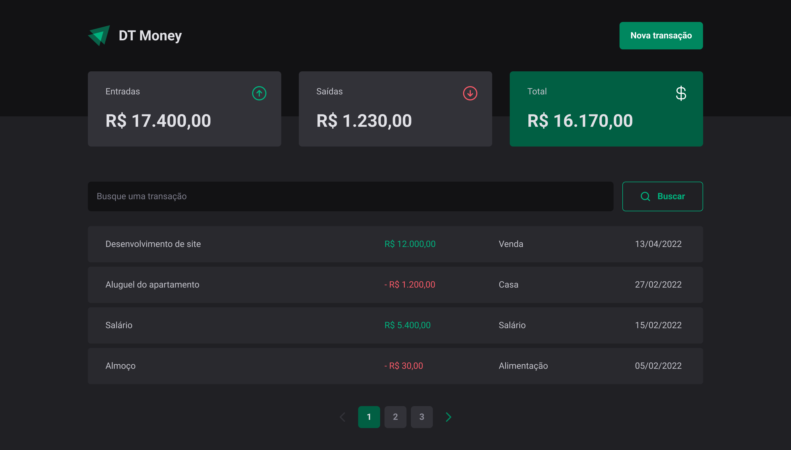

<h1 align="center">
  💰 DT Money
</h1>

  
  
  
  

 

  

## 💻 Projeto

O DT Money é uma aplicação de controle financeiro que permite o cadastro de entradas e saídas e a busca por filtros. Cada transação tem título, valor, categoria e data. Além de colocar em prática conhecimentos sobre TypeScrit, Styled-components, consumo de API e formulários no React, foi possível aprender mais sobre bibliotecas que melhoram a acessibilidade.  

## ✨ Tecnologias

Esse projeto foi desenvolvido com as seguintes tecnologias:

- [React](https://reactjs.org)
- [TypeScript](https://www.typescriptlang.org/)
- [Styled Components](https://www.npmjs.com/package/styled-components)

## 🛠 Funcionalidades
✔ Adicionar uma nova transação 
✔ Dar um título 
✔ Preencher o valor 
✔ Classificar por categoria 
✔ Inserir a data da transação 
✔ Buscar por filtro 

## 📖 Conhecimento
Com o Pomo Timer, aprendi a utilizar:
- `styled-components` para que a estilização e criação de temas;

## Utilização do projeto

### 💾 Baixar o projeto
Faça o clone do repositório para ter uma versão do projeto em sua máquina: 
`$ git clone https://github.com/mmanaclara/dt-money.git`

### 🧰 Instalar dependências
`$ npm install ou yarn`  

### 🚀 Iniciar o projeto
`$ npm run dev ou yarn dev`
 
Agora você pode acessar [`localhost:3000`](http://localhost:3000) do seu navegador.

## 📝 Licença
Este projeto está licenciado nos termos da licença [MIT](https://github.com/mmanaclara/dt-money/blob/main/LICENSE). 
